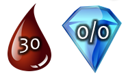
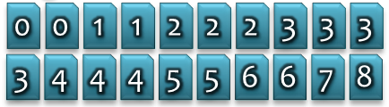
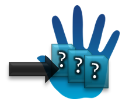
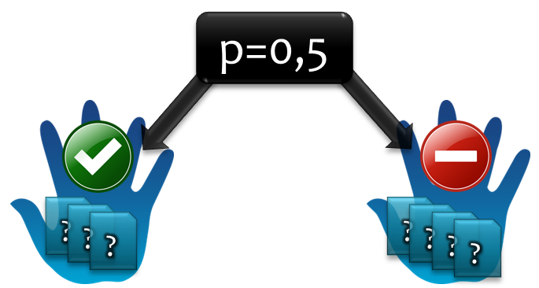
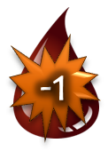
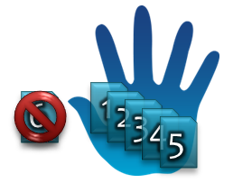

# Code Kata - Card Battle
Neste [Code Kata](http://en.wikipedia.org/wiki/Kata_(programming)) você irá implementar um jogo de troca de cartas entre dois players. As regras são inspiradas no jogo [Hearthstone - Heroes of Warcraft](http://us.battle.net/hearthstone/en/). Este Kata abre precedentes para diferentes focos (como utilizar cartas baseado no input dos usuários e/ou um algoritmo de decisão lógico) e pode conter diferentes abordagens incrementais com TDD.

Versão Pt-Br do [Kata](http://codingdojo.org/kata/TradingCardGame/).

## Regras

### Preparação

| Regra                                            |                                                  |
|:-------------------------------------------------|:-------------------------------------------------|
| Cada jogador começa o jogo com 30 de _Vida_ e 0 espaços de _Mana_. |  |
| Cada jogador começa com um baralho de 20 cartas de _Dano_ com o seguinte custo de _Mana_: 0,0,1,1,2,2,2,3,3,3,3,4,4,4,5,5,6,6,7,8. |  |
| Cada jogador começa com uma mão inicial de 3 cartas retiradas do baralho. |  |
| Um jogador é escolhido aleatoriamente para ser o primeiro jogador ativo. O outro jogador saca uma **quarta** carta do baralho para compensar não ter sido o primeiro no primeiro turno. |  |

### Regras básicas do Jogo

| Passo | Regra                                            |                                                  |
| :----- |:-------------------------------------------------|:-------------------------------------------------|
| 1 | O jogador da vez recebe 1 espaço de _Mana_, limitado a até 10 espaços no total. |  |
| 2 | Todos os espaços de _Mana_ disponíveis, do jogador da vez, são preenchidos no início da jogada. |  |
| 3 | O jogador da vez saca uma carta do baralho. |  |
| 4 | O jogador da vez pode usar quantas cartas ele puder pagar. Toda carta usada esvazia sua _Mana_ e dá dano imediato ao jogador oponente no valor correspondente ao custo da _Mana_ da carta. |  |
| 5 | Se a vida do jogador oponente cair para menos ou igual a zero, o jogador da vez ganha o jogo. |  |
| 6 | Se o jogador da vez não pode (seja por não ter cartas em sua mão ou não ter _Mana_ suficiente para jogar uma carta) ou simplesmente não quer jogar, o jogador oponente se torna o jogador da vez. |  |

### Regras especiais

| Rule           | Description                                                                                                                    |                                        |
|:---------------|:-------------------------------------------------------------------------------------------------------------------------------|:---------------------------------------|
| _Sangrar até morrer_ | Se o baralho de algum jogador se encontrar vazio antes do fim do jogo, ele receberá 1 de dano ao invés de jogar cartas durante seu turno. |  |
| _Sobrecarga_     | Se um jogador sacar uma carta do baralho e sua mão ficar >5 cartas, esta é imediatamente descartada.          |  |
| _Cartas cone_     | As cartas que custam 0 de _Mana_ podem ser jogadas de grátis mas não dão dano ao oponente. Estas são apenas para irritar os jogadores ocupando espaço em sua mão. |   |
